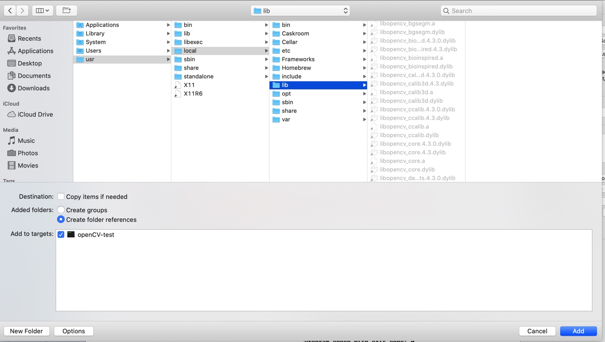
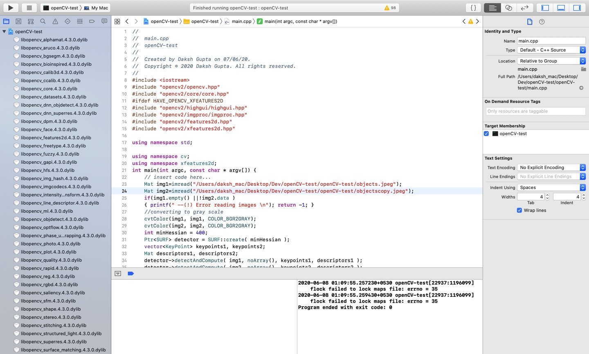

# openCV-MacOS-setup

Before starting this tutorial, I would like to give credits to Sonar System's Youtube video on the same topic. This tutorial was inspired from that video, and I am very grateful for that wonderful tutorial. Here is the link: https://www.youtube.com/watch?v=o62iO8SssZk. Also this tutorial suggests setting up of openCV without **CMake**. The only *prerequisite*, for this tutorial is **XCode**.


## Windows vs MacOS

- Since I have worked on both systems, and I still do, as I own a windows desktop and a macbook pro(laptop), and I keep switching from one system to another, according to needs and comfort level. I should make it clear right off the bat, you can't say one system is better than the other. Both work well, sometimes in diffrent circumstances, and there is no such thing, that once you start to work on MacOS, you will never go back to windows. It's subjective to the nature of your work, and also on your needs.

- Now we approaching this topic, in respect to openCV.Now, because of the introduction of openCV_contrib libraries, because of the patent issues and undergoing development. Thus for openCV 3.0 and higher, Feature detectors and matchers, are not directly available, as they were back in openCV 2.0 versions. Personally due to this factor, it became a little difficult for me to perform installations of these extra modules on **Windows**. I searched the net for hours, found some very reliable material, with a long hectic procedure, which ultimately lead to a deadlock of my CPU while setting up the **Visual Studio Community OpenCV.sln file**. I don't know if this problem is just local to my system, however, still, downloading the extra files to run algorithms like *SIFT,SURF,ORB etc*, is a painstakingly slow and memory heavy process, as it requires a CMAKE, unlike when you are only installing openCV(any verison).

- For Mac, I will say because of the video, and the common availability of the missing package manager, **Homebrew**, the task of having the extra packages became much easier. I am going to elaborate on the process, in later part of the tutorial.

**NOTE**: Try to use Visual Studio Community for Windows and XCode for MacOS, and if you are a Linux user, you have an easy life!


## Tutorials:

### STEP 1:
Install **Homebrew**, from the given link: https://brew.sh . You just need to copy the line of code, given there on the site and paste it on your command line. It doesn't matter if you are using a **bash or ZSH shell**. It will take some time in installation, and before that it will ask your password. Just enter it, however the characters won't be visible. Don't worry, just keep typing it.


### STEP 2:
Now type the command ``` brew install opencv ```, on the terminal. Make sure you are in the root directory. This will install openCV, and again it's going to take some time.

### STEP 3:
Open up the XCode, click on *create new project* and choose *Command Line Tool*, and click on *next*. Enter the product name and select the language(C++ or python). Save it in any folder you feel comfortable with.

### STEP 4:
You will see a project with the given project name will be created. Right click and choose *Add files to project_name* option. For Macbook Air, Pro etc. press *Control*, and then click on the *trackpad*. This is an equivalent for a right click. Now a scary view of folders will present itself to you. Just, click '/', on your keyboard, and a message box will appear, with an overhanging text, *Go to the folder*.Type this */usr/local/lib*. A bundle of files will appear on the right. Now these are basically all the libraries that you need for working in openCV, on XCode. 

If you will have the version number written towards the end of the file, latest at the current moment, 4.3.0. Some files will be starting off with the name *libopencv...*, these are the most important ones, and actually these are the only ones which you will be requiring. I will suggest adding all of the latest version ones to the project. 





### STEP 5:
So the thing is, you have to download/add all the files ending with an extension *4.3.0.dylib*. For my Feature-detection project, I downloaded all these files, as you can see in the below screenshot. Hence the point to consider is, now you will see ```xfeature2d``` library and many more which are a part of **openCV_contrib** package. Thus you don't need to hassle or search around or download an extra zip file for the same. For multi-selection of the files, use *Commmand* button on the keyboard. Keep holding it, until you select all the required ones.
**NOTE**: You have to do this for each new project.





### STEP 6 :
After you close it, you will see them added like a waterfall. Now go to *Build Settings* and choose *ALL*. Type in search, *header search paths*. On right side of System Header Search Paths, click twice, a drop down thing will appear which will be empty. Click on the '+' option, and add this, */usr/local/include/opencv4*. Be careful, while adding the version of openCV while writing the latter command, albeit what you will download will be above 4.0. Also set the *Framework Search Paths* to */usr/local/lib* and change the *Always search User Paths* to *Yes*.

### STEP 7:
You are all done, you can go to the ```main.cpp``` file and code openCV. Cheers!


## Tips and Suggestions:
- While dealing with images, after downloading from the net, save them in the save directory as that of ```main.cpp```, however I still recommend passing the complete path to the image. Just right click, open *getInfo*, and then, copy the path using *Command+C* from *Where* category. Paste the path in imread(), and don't forget to add the name of the image. Also save the name of the image as "books.jpeg" instead of just "books"
- Try using ```using namespace cv``` and ```using namespace xfeatures2d```. This will solve a lot of problems in your life!
- In MacOS, try not to give ```waitKey()``` a value of 0. It kind of sometimes stops the code(however very rare), try putting in 10000 or 15000.
- Just enjoy openCV!

## Author
Daksh Gupta

